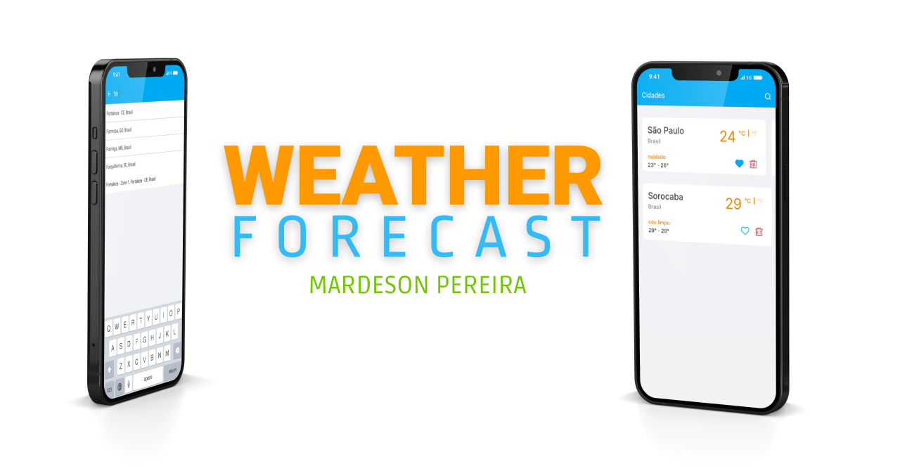

<div align="center">
  
</div>

# Índice

- [Índice](#índice)
- [Sobre](#sobre)
- [Tecnologias Utilizadas](#tecnologias-utilizadas)
- [Requerimentos](#requerimentos)
  - [Necessidades para executar](#necessidades-para-executar)
  - [Como executar?](#como-executar)
    - [Clonar](#clonar)
    - [Criar arquivo de configurações](#criar-arquivo-de-configurações)
    - [Instalar os pacotes](#instalar-os-pacotes)
    - [Executando o projeto](#executando-o-projeto)
- [Licença](#licença)

# Sobre

Desenvolvido como uma avaliação para a vaga de desenvolvedor mobile _pleno_ na Spartan Labs, o app faz consultas às apis do [Google Places](https://developers.google.com/maps/documentation/places/web-service/overview) e [Open Weather Map](https://openweathermap.org/api) e condensa os resultados de clima/cidade obtidos em tela.

# Tecnologias Utilizadas

Todo o projeto está sendo feito em um ambiente **Node**, utilizando uma versão **LTS** e utilizando o sistema operacional Linux Ubuntu

- [TypeScript](https://www.typescriptlang.org/)
- [Node.js](https://nodejs.org/)
- [React Native](https://reactnative.dev/)
- [Expo](https://docs.expo.dev/)
- [Expo](https://yarnpkg.com/)

# Requerimentos

 É necessário uma IDE para desenvolver e utilizo e recomendo o uso do [Visual Studio Code](https://code.visualstudio.com/)

## Necessidades para executar

- Node.js
- Android Studio
- Yarn

## Como executar?

Para executar, siga as etapas a seguir:

### Clonar

Clone o projeto utilizando o código a seguir ou [baixe diretamente](https://github.com/mardesonmax/weather-forecast-react-native/archive/refs/heads/main.zip)

```sh
# https
git clone https://github.com/mardesonmax/weather-forecast-react-native

# ssh
git clone git@github.com:mardesonmax/weather-forecast-react-native.git
```

### Criar arquivo de configurações

Execute o comando a seguir ou copie o arquivo `.env.example` para `.env`.

```sh
cp .env.example .env
```

Após criar o arquivo `.env`, abra para editar as seguintes linhas:

- **WEATHER_KEY**, [Acesse aqui](https://openweathermap.org/api) para obter a key
- **PLACE_API_KEY**, [Acesse aqui](https://console.cloud.google.com/projectselector2/google/maps-apis/credentials) para obter a key

### Instalar os pacotes

Execute o comando a seguir para executar os pacotes:

```sh
yarn install
```

### Executando o projeto

Execute o comando a seguir para executar o projeto

```sh
yarn start
yarn android # ou
yarn ios
```

# Licença

Esse projeto está sob a [licença](./license.md) do MIT.
